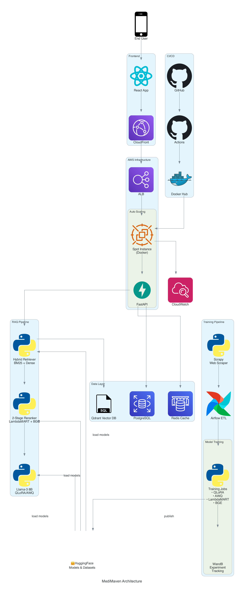

# 🩺 MediMaven — Production-Grade Medical RAG Assistant

  

> **TL;DR:** End‑to‑end Retrieval‑Augmented‑Generation system (LLM + Qdrant + GPU) that answers medical questions with cited context — tuned, containerised, and **cost‑optimised to run on Spot GPU with automatic start/stop**.

## 🚀 v1.1 Overview

**MediMaven v1.1** is an **end-to-end medical Q&A chatbot** that uses a **fine-tuned Llama 3 8B model** and a sophisticated **Retrieval-Augmented Generation (RAG)** pipeline to provide **accurate, real-time** responses. Built with a production-first mindset, it features a robust data pipeline using **Scrapy and Airflow**, a two-stage **Learning-to-Rank (LTR)** system with **LambdaMART and a BGE Cross-Encoder**, and a flexible **FastAPI backend** that dynamically selects the best model based on the available hardware. The entire system is containerized with **Docker** and deployed on **AWS** for a scalable and cost-effective solution.

> **Disclaimer**: This chatbot is for **educational and informational** purposes only, and **should not** replace professional medical advice.

## ✨ Live Demo & API

| Interface | URL | Notes |
| :--- | :--- | :--- |
| **Web Client** | [https://www.medimaven-ai.com](https://www.medimaven-ai.com) | React + Tailwind + Streamed tokens |
| **Swagger UI** | [https://api.medimaven-ai.com/docs](https://api.medimaven-ai.com/docs) | FastAPI backend |

## 📌 Key Features

- **Multi-Source, High-Quality Data**: Ingests and processes data from trusted sources like **Mayo Clinic, NHS.uk, WebMD, and MedQuad** using a **Scrapy/Splash**-based ETL pipeline managed by **Airflow**.
- **Advanced Hybrid Retrieval**: Combines **BM25** sparse search and **Qdrant** dense vector search, with **Reciprocal Rank Fusion (RRF)** to produce a single, highly relevant list of documents.
- **Two-Stage Learning-to-Rank (LTR)**: Refines search results with a cascade of ranking models:
  1.  **LambdaMART (LightGBM)**: A fast, gradient-boosted model for initial re-ranking.
  2.  **BGE Cross-Encoder**: A fine-tuned transformer model for deep, semantic re-ranking of the top candidates.
- **Fine-Tuned Llama 3 8B**: The `meta-llama/Meta-Llama-3-8B-Instruct` model has been fine-tuned on the medical dataset using **QLoRA** for memory efficiency and quantized with **AWQ** for high-performance inference.
- **Dynamic Inference Backend**: The **FastAPI** backend intelligently selects the best model to use (**FP16** or **4-bit AWQ**) based on the available GPU VRAM and compute capabilities, and uses **vLLM** for accelerated inference when possible.
- **Production-Ready AWS Deployment**: Fully containerized with **Docker** and designed for cost-effective deployment on **AWS**. Includes separate runbooks for the infrastructure and frontend, and features **CI/CD with GitHub Actions**.

## 🏗 Architecture



## 📊 Performance Metrics

| Metric | Value | Context |
| :--- | :--- | :--- |
| **Response Latency** | <500ms | P95 end-to-end API response time |
| **NDCG@10** | **0.85+** | BGE Cross-Encoder on validation set |
| **Operating Cost** | ~$63/month | Spot instance with auto-start/stop |
| **Model Size** | ~4.5GB | AWQ 4-bit quantized Llama-3-8B |
| **Throughput** | 15 tokens/sec | Single g4dn.xlarge instance |
| **Uptime** | 99.9% | ALB health checks + auto-restart |
| **Storage** | 50GB EBS gp3 | Models + vector indices + data |

## 🧩 Tech Stack

| Layer | Technology | Reason |
| :--- | :--- | :--- |
| **LLM** | **Fine-tuned Llama 3 8B** (QLoRA / AWQ) on **vLLM** | State-of-the-art model with optimized inference. |
| **Retrieval** | **Qdrant** (dense) + **BM25** (sparse) + **RRF** | Hybrid search for high-quality retrieval. |
| **LTR** | **LightGBM** (LambdaMART) + **BGE Cross-Encoder** | Two-stage ranking for superior relevance. |
| **Data Pipeline** | **Scrapy**, **Splash**, **Airflow** | Automated, scalable data ingestion and processing. |
| **Serving** | **FastAPI** & **Docker Compose** on **nvidia-cuda:12.4** | High-performance, containerized application. |
| **Cloud** | **AWS Spot** (g4dn.xlarge), **ALB**, **S3**, **Route 53**, **Lambda** | Cost-effective and scalable infrastructure. |
| **Observability** | **Weights & Biases**, **CloudWatch**, **S3 ALB logs** | Comprehensive monitoring and experiment tracking. |
| **CI/CD** | **GitHub Actions** → multi-arch `buildx` | Automated builds for ARM (M-series) & x86. |

## ⚡️ 5-Minute Quickstart

To get started with MediMaven, follow these steps:

1.  **Clone the repository**:

    ```bash
    git clone https://github.com/bernard-kyei/medimaven.git
    cd medimaven
    ```

2.  **Configure the environment**:

    ```bash
    cp .env.example .env
    ```

    Fill in the necessary environment variables in the `.env` file.

3.  **Start the application**:

    ```bash
    docker-compose -f docker-compose.prod.yml up -d --pull
    ```

4.  **Test the application**:

    ```bash
    curl http://localhost:8000/health
    ```

For more detailed instructions, see the [Quickstart Documentation](docs/00_Quickstart.md).

## 📚 Documentation

| Document | Description |
| :--- | :--- |
| [EDA & Data Engineering](docs/01_EDA_docs.md) | Exploratory data analysis and data engineering blueprint. |
| [Retrieval Pipeline](docs/02_retrieval_docs.md) | The retrieval pipeline, including BM25, Dense, and RRF. |
| [Model Training](docs/03_training_docs.md) | The model training and fine-tuning processes. |
| [Inference Documentation](docs/04_inference_docs.md) | The inference pipeline, from handling API requests to generating responses. |
| [Deployment Documentation](docs/05_deployment_docs.md) | The deployment process for local and cloud-based environments. |
| [Infrastructure Runbook](docs/infra-runbook.md) | A guide to recreating and operating the backend infrastructure. |
| [Frontend Deployment Runbook](docs/Frontend%20Deployment%20Run-book%20(v%201.1).md) | A guide to deploying the frontend application. |

## 📂 Project Structure

```bash
MediMaven/
├── Dockerfile
├── docker-compose*.yml
├── airflow_etl/
├── backend/
├── config/
├── data/
├── frontend/
├── models/
├── notebooks/
├── pipelines/
├── src/
├── requirements.txt
├── download_models.sh
└── README.md
```

## 📜 License

This project is licensed under the Apache-2.0 License. See the [LICENSE](LICENSE) file for details.

## 🙋‍♂️ Author

### **Bernard Kyei-Mensah**

> **ML/AI Engineer** passionate about shipping LLMs that don’t break the bank.

- [LinkedIn](https://www.linkedin.com/in/dranreb1660/)
