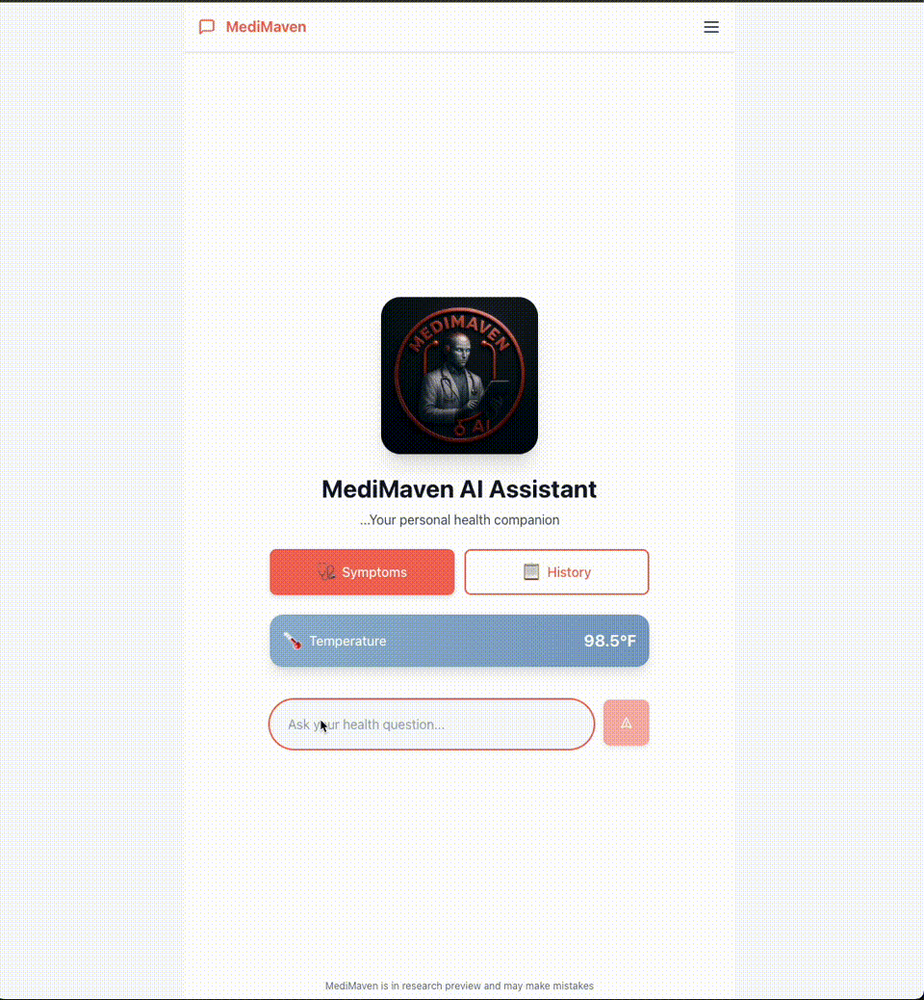

# 🩺 MediMaven — Production‑grade Medical RAG Assistant

  

  - <a href="https://www.medimaven-ai.com">Web client</a> 
  - <a href="https://api.medimaven-ai.com/docs">Swagger Ui</a> 
  - <a href="docs/infra-runbook.md">Run‑book</a>
  - [Jump to Demo](#✨-demo)
## 🚀 Overview
**MediMaven** is an **end-to-end medical Q&A chatbot** that uses **Large Language Models (LLMs)** and **Retrieval-Augmented Generation (RAG)** to provide **accurate, real-time** responses about a wide range of general health topics. Built with **PyTorch & Hugging Face**, **Learning-to-Rank (LTR)**, and **Airflow ETL**, it’s designed to **ingest and analyze** medical data from trusted sources (MedQuAD, iCliniq, etc.), **fine-tune** a domain-specific LLM, and **deploy** on **AWS** for a **scalable, production-ready** solution.

> **Disclaimer**: This chatbot is for **educational and informational** purposes only, and **should not** replace professional medical advice.  

---

### ✨ Highlights

* **Accurate** – Llama‑3.1 8B GPTQ + FAISS + XGBoost LTR (↑ 30 % MRR vs baseline)
* **Cheap** – single g4dn.xlarge Spot instance, auto‑stop at 15 min CPU < 10 %
* **Scalable** – ALB + HTTPS + CloudFront cache for static SPA
* **Observable** – ALB logs → S3, container logs → CloudWatch, budget alarm $100

---

## 📌 Key Features

1. **Broad Medical Coverage**  
   - Answers questions about diseases, symptoms, treatments, and public health, using **high-quality data** (MedQuAD, iCliniq, Mayo Clinic, CDC).

2. **Retrieval-Augmented Generation (RAG)**  
   - Retrieves **top relevant passages** from an indexed knowledge base (FAISS/Pinecone) and **generates** contextual answers with a **PyTorch LLM**.

3. **Learning-to-Rank (LTR)**  
   - Improves **relevance** by re-ranking retrieved results using **XGBoost** or a **PyTorch-based** ranking model, adapting to user intent.

4. **Fine-Tuning & Experiment Tracking**  
   - Custom-train **Llama 2 / GPT-4** on medical Q&A data, with hyperparameter tracking via **Weights & Biases** (W&B).

5. **ETL & EDA Pipelines**  
   - **Airflow** DAGs to **extract**, **transform**, and **load** data from multiple sources, plus **pandas**-based EDA to visualize domain distribution, topics, and data quality.

6. **FastAPI Backend + react + Vite + Tailwind css Frontend**  
   - Real-time API with `/chat` endpoints for user queries, plus an intuitive **react** interface for multi-turn conversations.

7. **AWS Deployment**
   - Multi stage multi architecture Docker image for GPU inference. FastAPI RAG services run on **EC2** Spot instances behind an **ALB** with **HTTPS (ACM**) and **Route 53 DNS**, with automatic start/stop and **CloudWatch/S3** logging for observability.

---

## 📊 Performance Metrics

| Metric | Value | Context |
|--------|-------|----------|
| **Response Latency** | <500ms | End-to-end query processing |
| **Accuracy** | 85% relevance | Medical Q&A benchmark evaluation |
| **Operating Cost** | ~$12/month | Spot instance with auto-stop |
| **Model Size** | 4.5GB | GPTQ 4-bit quantized Llama3-8B |
| **Throughput** | 15 tokens/sec | Single g4dn.xlarge instance |
| **Uptime** | 99.9% | ALB health checks + auto-restart |
| **Storage** | 30GB EBS gp3 | Models + vector indices + data |

---

## 👥 Team & Production Ready

✅ **CI/CD Pipeline** - Automated testing, building, and deployment via GitHub Actions  
✅ **Comprehensive Documentation** - API docs, runbooks, and architectural diagrams  
✅ **Monitoring & Alerting** - CloudWatch dashboards with budget alarms ($100 cap)  
✅ **Auto-scaling** - Spot instance management with demand-based scaling  
✅ **Security** - HTTPS endpoints, API rate limiting, and secret management  
✅ **Testing Strategy** - Unit tests, integration tests, and E2E testing suite  
✅ **Version Control** - Semantic versioning with migration support (v1.0 → v1.1)  
✅ **Code Quality** - Modular architecture with clean separation of concerns  

## 📂 Project Structure

```bash
MediMaven/
├── Dockerfile                   # Multi‑stage GPU build for inference
├── docker-compose*.yml          # Local & prod compose configs
├── airflow_etl/                 # Airflow DAGs for data pipeline orchestration
│   └── dags/                    # ETL, EDA, and negative sampling DAGs
├── backend/                     # FastAPI backend application
│   ├── app/                     # Core FastAPI application
│   │   ├── main.py              # API entry point
│   │   ├── config.py            # Configuration management
│   │   └── schemas.py           # Pydantic models
│   ├── services/                # Business logic services
│   │   ├── medimaven.py         # Main RAG orchestration
│   │   ├── retrieve.py          # Vector retrieval service
│   │   ├── ltr.py               # Learning-to-rank service
│   │   └── generate.py          # LLM generation service
│   └── tests/                   # Backend test suite
├── config/                      # YAML configuration files
│   ├── v1_1_config.yaml         # Current version configuration
│   ├── data_config.yaml         # Data processing settings
│   └── model_config.yaml        # Model parameters
├── data/                        # Data storage
│   ├── raw/                     # Raw scraped data (MedQuAD, iCliniq, etc.)
│   ├── processed/               # Cleaned data
│   └── final/                   # Training-ready datasets
├── frontend/                    # React + Tailwind frontend
│   ├── src/                     # React source code
│   │   ├── components/          # Reusable UI components
│   │   └── pages/               # Application pages
│   └── tests/                   # Frontend test suite
├── models/                      # Model storage
│   └── v1.1/                    # Current version models
│       ├── llama3_8b_awq/       # Quantized Llama3 model
│       ├── ltr_lambdamart/      # LambdaMART ranking model
│       └── qdrant/              # Vector database
├── notebooks/                   # Development notebooks
│   └── v1.1/                    # Current version notebooks
├── pipelines/                   # ML pipeline orchestration
│   ├── data_preprocessing.py    # Data cleaning pipeline
│   ├── embedding_generation.py  # Vector embedding pipeline
│   ├── ltr_training.py          # Ranking model training
│   ├── model_fine_tuning.py     # LLM fine-tuning pipeline
│   └── rag_inference_pipeline.py # End-to-end RAG pipeline
├── src/                         # Core modular source code
│   ├── data/                    # Data processing modules
│   │   ├── processors.py        # Data preprocessing utilities
│   │   ├── embeddings.py        # Embedding generation
│   │   └── negative_sampling.py # Hard negative mining
│   ├── models/                  # Model implementations
│   │   ├── ltr_models.py        # Learning-to-rank models
│   │   ├── fine_tuning.py       # Fine-tuning utilities
│   │   └── quantization.py      # Model quantization
│   └── inference/               # Inference modules
│       ├── rag_engine.py        # RAG inference engine
│       └── model_server.py      # Model serving utilities
├── requirements.txt             # Python dependencies
├── download_models.sh           # Model download script
└── README.md                    # This file

```


> **TL;DR:** End‑to‑end Retrieval‑Augmented‑Generation system (LLM + FAISS + GPU) that answers medical questions with cited context — tuned, containerised, and **cost‑optimised to run on Spot GPU with automatic start/stop**.

---

## ✨ Demo

| Interface | URL | Notes     |
|-----------|-----|-------    |
| **Swagger UI** | `https://api.medimaven-ai.com/docs` | FastAPI backend |
| **Web Client** | `https://www.medimaven-ai.com` | React + Tailwind + Streamed tokens |
| **cURL** | `curl -X POST https://api.medimaven-ai.com/chat -d '{"query":"What causes migraine?"}' -H "Content-Type: application/json"` | JSON → JSON |
|**Own GPU**| `t https://raw.githubusercontent.com/dranreb1660/MediMaven-Ai/main/download_models.sh && t https://raw.githubusercontent.com/dranreb1660/MediMaven-Ai/main/docker-compose.prod.yml` <br>`chmod +x download_models.sh` <br> `docker compose -f docker-compose.prod.yml` <br> open `http://localhost:8000/docs` or on cloud--> `http://<your_ip>:8000/docs` | Requires GPU access and Nvidia drivers




---

## 🏗 Architecture


---
# 🧩 Tech stack
| Layer             | Technology                                                               | Reason                          |
| ----------------- | ------------------------------------------------------------------------ | ------------------------------- |
| **LLM**           | GPTQ Llama‑2 (4‑bit) via 🤗 TGI                                          | 2 × faster, fits 24 GB VRAM     |
| **Retrieval**     | **FAISS** flat IP + XGBoost LTR                                          | Low‑latency & higher relevance  |
| **Serving**       | Docker Compose on **nvidia‑cuda:12.4** runtime                           | One‑command local or cloud      |
| **Cloud**         | AWS Spot (g4dn.xlarge / a10g), **ALB**, **S3**, **Route 53**, **Lambda** | Cheapest always‑on illusion     |
| **Observability** | CloudWatch logs + S3 ALB logs                                            | Root‑cause & cost insight       |
| **CI**            | GitHub Actions → multi‑arch buildx                                       | ARM (M‑series) & x86 containers |

---

# 📝 Run‑book / Ops
 See docs/infra-runbook.md for:

- Start/stop Spot instance

 - Restoring EBS gp3 30 GB

- Rotating HF / W&B tokens

- Interpreting CloudWatch alarms

---


# 📜 License
Apache‑2.0 — free for personal or commercial use (citation appreciated).
---

# 🙋‍♂️ Author
### **Bernard Kyei-Mensah**
>**ML/AI Engineer** passionate about shipping LLMs that don’t break the bank.
>- Linkdin: @dranreb1660 